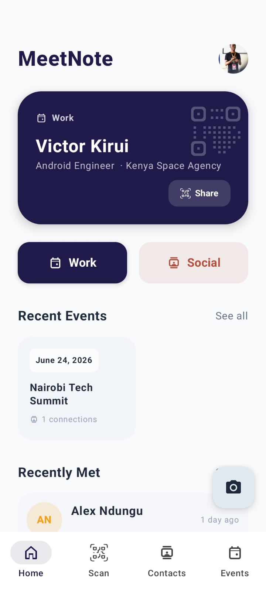
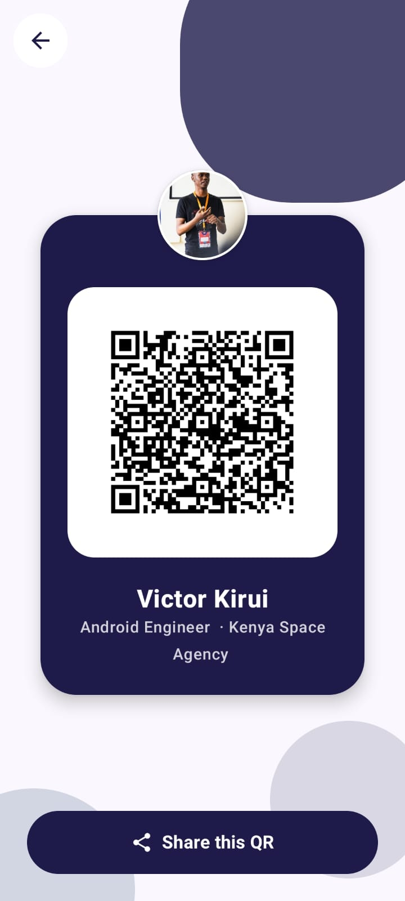
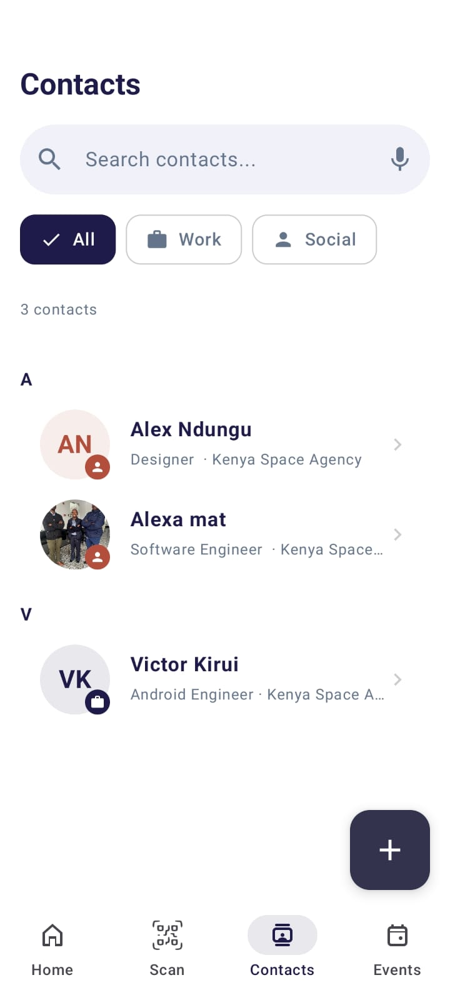
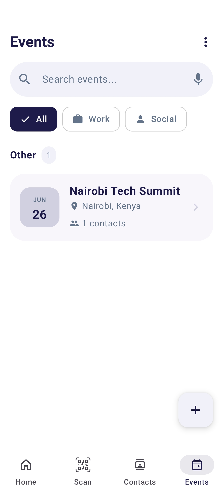

# MeetNote

MeetNote is a professional networking and contact management application designed to help users bridge the gap between initial meetings and long-term professional relationships. It serves as a digital business card and a context-aware CRM for conferences, summits, and social meetups.

## Project Overview

MeetNote addresses the common problem of forgetting the context of how and where you met someone. By focusing on the meeting context and event-based organization, it ensures that every new connection is captured with relevant details, social links, and notes.

## Key Features

### Dual Profile Management
Users can maintain two distinct digital identities:
*   **Work Profile**: Professional details including job title, organization, and professional social links like LinkedIn.
*   **Social Profile**: Personal details focused on casual networking and personal social handles.

### Digital Business Card (QR Sharing)
*   Generate unique QR codes for both Work and Social profiles.
*   Share contact information instantly without physical cards.
*   Optimized QR code display with profile preview.

### Smart Contact "Catching"
*   Integrated QR scanner to instantly add new contacts.
*   Contextual association: Link new contacts to specific events.
*   Auto-population of contact details from scanned QR data.

### Event-Based Organization
*   Create and manage professional or social events.
*   View all contacts met during a specific event.
*   Track the growth of your network over time across different venues.

### Comprehensive Contact Details
*   Store phone numbers, email addresses, organizations, and roles.
*   Manage multiple social media links.
*   Dedicated notes section for each contact to record specific conversation details.
*   Integrated actions for direct calling, emailing, or messaging.

### Advanced Search
*   Voice-enabled search functionality for quick contact discovery.
*   Filtering by profile category (Work vs. Social).
*   Alphabetical grouping for easy navigation.

## Tech Stack

### Frameworks and Libraries
*   **Language**: Kotlin
*   **UI Framework**: Jetpack Compose (Material 3)
*   **Architecture**: Clean Architecture with MVVM
*   **Dependency Injection**: Koin
*   **Database**: Room (with KSP)
*   **QR Processing**: ZXing (Zebra Crossing)
*   **Image Loading**: Coil 3
*   **Navigation**: Jetpack Navigation Compose
*   **Local Storage**: DataStore (Preferences)
*   **Asynchronous Programming**: Kotlin Coroutines and Flow

### Architecture Patterns
*   **Layered Architecture**: Separation of concerns across Data, Domain, and Presentation layers.
*   **Offline-First**: All data is stored locally using Room, ensuring the app works without an internet connection.
*   **Usecase Pattern**: Business logic is encapsulated in single-purpose use cases for better testability and maintainability.

## Screenshots

|             Home Screen              |               QR Share                |                 Contact List                 |                Event List                |
|:------------------------------------:|:-------------------------------------:|:--------------------------------------------:|:----------------------------------------:|
|  |  |  |  |

## Getting Started

### Prerequisites
*   Android Studio Ladybug or newer.
*   JDK 17 or higher.
*   Android device or emulator running API level 24 (Android 7.0) or higher.

### Installation
1. Clone the repository.
2. Open the project in Android Studio.
3. Sync the project with Gradle files.
4. Build and run the application on your device/emulator.

## License

This project is licensed under the MIT License - see the LICENSE file for details.
